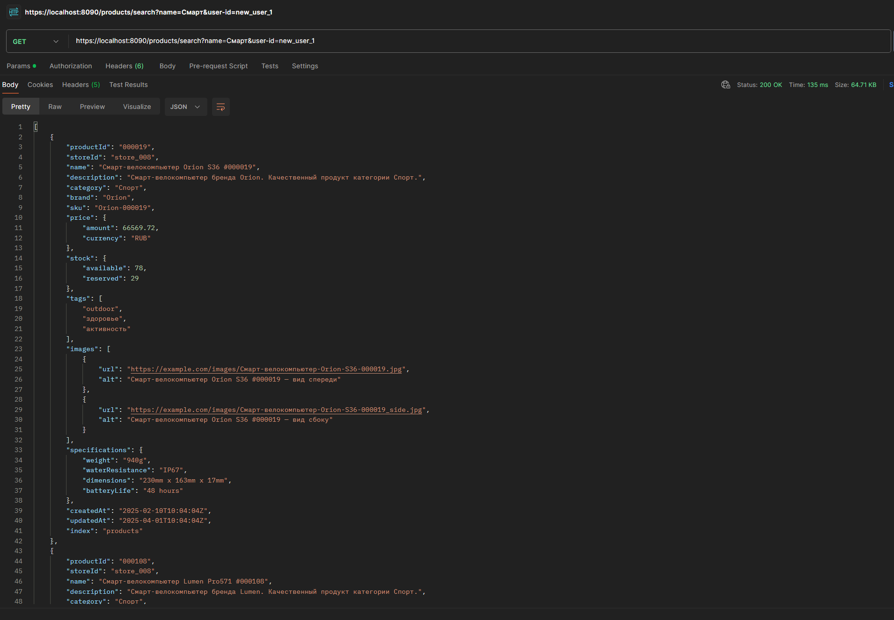
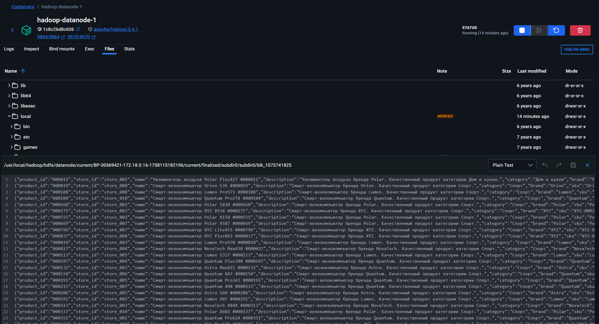

# МФинальный проект

Данный проект демонстрирует работу аналитической платформы маркетплейса

___

## Структура проекта

| Компонент                                 | Описание                                                     |
|-------------------------------------------|--------------------------------------------------------------|
| [Сертификаты](certificate_generation)     | Генерирует все необходимые сертификаты для проекта           |
| [Сервис "Клиент"](client)                 | Сервис для клиентов (поиск, получение рекомендаций)          |
| [Elasticsearch](elasticsearch)            | Поискова система (для поиска товаров)                        |
| [Hadoop (HDFS)](hdfs)                     | Система хранения больших данных (для обработки рекомендаций) |
| [Kafka ACL](kafka_acl)                    | Управление ACL в Kafka                                       |
| [Kafka connect](kafka_connect)            | Коннектор (для CDC Elasticsearch)                            |
| [Kafka mirroring](kafka_mirroring)        | Репликация Kafka кластера                                    |
| [Kafka UI](kafka_ui)                      | Веб интерфейс Kafka                                          |
| [Сервис "Фильтр товаров"](product_filter) | Сервис для фильтрации товаров в реальном времени             |
| [Сервис "Магазин"](shop)                  | Сервис имитирующий запросы от магазинов                      |

---

## Запускаемые контейнеры

| Контейнер                    | Назначение                                                    |
|------------------------------|---------------------------------------------------------------|
| Kafka Cluster 0 (KRaft)      | 3 контроллера + 3 брокера                                     |
| Kafka Cluster 1 (KRaft)      | 3 контроллера + 3 брокера                                     |
| Kafka Connect                | Интеграция с Elasticsearch (sink)                             |
| Schema Registry              | Работа с Avro-схемами                                         |
| Kafka UI                     | Визуальное управление Kafka                                   |
| Kafka Connector Setup        | Одноразовый контейнер для настройки коннекторов Kafka Connect |
| Certificate Generation Setup | Одноразовый контейнер для генерации необходимых сертификатов  |
| Kafka Cluster 0 ACL Setup    | Одноразовый контейнер для настройки ACL                       |
| Kafka Cluster 1 ACL Setup    | Одноразовый контейнер для настройки ACL                       |
| Elasticsearch                | Поисковая система                                             |
| Kafka Mirroring              | Репликация кластера                                           |
| KSQL DB                      | Работа с Kafka как с помощью запросов                         |
| Client                       | Сервис для клиентов (поиск, получение рекомендаций)           |
| Shop                         | Сервис имитирующий запросы от магазинов                       |
| Product Filter               | Сервис для фильтрации товаров в реальном времени              |
| Hadoop (HDFS)                | Для хранения данных                                           |
| NiFi                         | Маршрутизация данных                                          |

___

## Описание

### Процесс фильтрации данных

1. Система инициализирует список запрещенных товаров и публикует в
   Kafka (9 шт.) 
2. Система публикует товары с магазинов (999 шт.)
3. Фильтрация на основе черного списка 

Так же есть возможность ручного управления списком запрещенных товаров:

* Endpoint для блокировки `https://localhost:8092/black-list/{productID/block}`
* Endpoint для разблокировки `https://localhost:8092/black-list/{productID/unblock}`

Ручное добавление товара:

* Endpoint для создания товара `https://localhost:8091/products`

Демонстрация:

1. Блокировка товара 
2. Разблокировка товара 
3. Генерация нового товара который заблокирован 
4. Генерация нового товара который не заблокирован 
5. Содержимое черного списка 
6. Содержимое исходного списка товаров 
7. Содержимое отфильтрованного списка товаров 

### Процесс поиска товаров

1. Коннектор Elasticsearch Sink слушает топик `shop.product.filtered` и записывает данные в Elasticsearch
2. У сервиса Client появляется возможность поиска товаров по названию

Поиск товара:

* Endpoint для поиска `https://localhost:8090/products/search?name={product-name}&user-id={user-id}`

Демонстрация:

1. Данные записались в Elasticsearch 
2. Поиск 

### Процесс выдачи рекомендаций (KSQL DB)

1. Результаты поиска отправляются в Kafka Cluster 0, в топик `client.search.result`
2. Данные Kafka Cluster 0 реплицируются на Kafka Cluster 1
3. В KSQL DB инициализируется таблица. Она хранит последнее значение (товар) из списка выданным при поиске для каждого
   пользователя

Рекомендации доступны по рест вызову:

* Endpoint для получения рекомендаций `https://localhost:8090/product-recommendations/{user-id}`

Демонстрация:

1. Таблица будет хранить одно значение для каждого пользователя 

### Процесс отправки данных в HDFS

1. Основные топики реплицируются на второй кластер 
2. С помощью Apache NiFi данные из топика `client.search.result` переносятся в HDFS 
3. Данные в HDFS 

___

## Запуск

Необходимо последовательно запустить команды ниже и дожидаться пока каждый контейнер не поднимется

```shell
    docker compose up -d certificate-generation elasticseach hadoop-namenode spark-master
```

```shell
    docker compose up -d kafka-0-controller-0 kafka-0-controller-1 kafka-0-controller-2 kafka-1-controller-0 kafka-1-controller-1 kafka-1-controller-2 nifi spark-worker-1 spark-worker-2 hadoop-datanode-1
```

```shell
    docker compose up -d kafka-0-broker-0 kafka-0-broker-1 kafka-0-broker-2 kafka-1-broker-0 kafka-1-broker-1 kafka-1-broker-2 
```

```shell
    docker compose up -d kafka-0-acl kafka-1-acl kafka-ui
```

```shell
    docker compose up -d schema-registry kafka-connect-mirroring
```

```shell
    docker compose up -d kafka-connect ksql-db product-filter
```

```shell
    docker compose up -d kafka-connector-setup client shop
```

Так как в проекте есть NiFi, необходимо импортировать в него [файл](kafka_to_hdfs_flow.xml) (процесс передачи данных из
kafka в hdfs)

## Проверка

* В качестве проверки можно посмотреть данные в [Kafka UI](http://localhost:8080)
* Все ендпойнты вызываются с https (кроме Kafka UI). Для этого
  сгенерен [клиентский сертификат](certificate_generation/certificates/client_cli)
* [Коллекция Postman](Final_Project.postman_collection.json). Так же желательно
  установить [сертификаты](certificate_generation/certificates/client_cli), 

